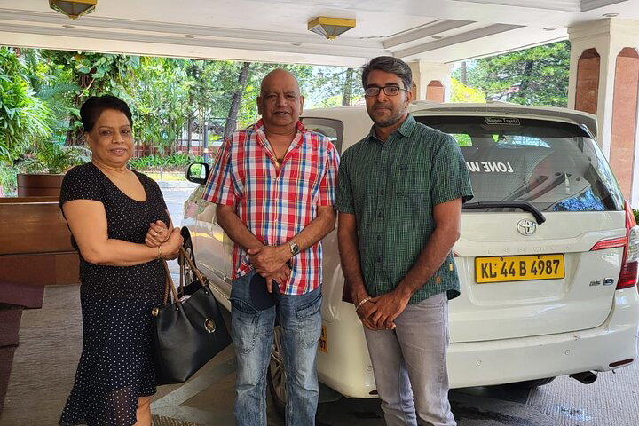

<!-- ================= PREMIUM HEADER ================= -->
<header class="luxury-header">
  

    
    

      
    

    <nav class="header-nav">
      <ul>
        <li><a href="#">About Us</a></li>
        <li><a href="#">Kochi Airport Taxi</a></li>
        <li><a href="#">Tempo Rentals</a></li>
        <li><a href="#">South India Tours</a></li>
        <li><a href="#">Reviews</a></li>
      </ul>
    </nav>

    

      

        <svg width="18" height="18" viewBox="0 0 24 24" fill="none" stroke="#ffcc00" stroke-width="2" stroke-linecap="round" stroke-linejoin="round">
          <path d="M22 16.92v3a2 2 0 0 1-2.18 2 19.79 19.79 0 0 1-8.63-3.07 19.5 19.5 0 0 1-6-6 19.79 19.79 0 0 1-3.07-8.67A2 2 0 0 1 4.11 2h3a2 2 0 0 1 2 1.72 12.84 12.84 0 0 0 .7 2.81 2 2 0 0 1-.45 2.11L8.09 9.91a16 16 0 0 0 6 6l1.27-1.27a2 2 0 0 1 2.11-.45 12.84 12.84 0 0 0 2.81.7A2 2 0 0 1 22 16.92z"></path>
        </svg>
      

      

        Book Now
        <a href="tel:+919400620615" class="phone-number">+9194006 20615</a>
      

    

  

</header>

<!-- ================= CINEMATIC HERO SECTION ================= -->
<section class="hero-slider">
  

    

      

        <h1>South India Tours & Beyond</h1>
        
Personalized journeys across Kerala and Tamil Nadu with premium vehicles and unmatched hospitality.

        <a href="https://wa.me/919400620615" class="luxury-btn">Plan Your Journey</a>
      

    

  

  

    

      

        <h1>Kerala & Tamil Nadu Escapes</h1>
        
Custom holidays, cultural heritage tours, and spiritual pilgrimages across South India.

        <a href="https://wa.me/919400620615" class="luxury-btn">Discover Packages</a>
      

    

  

  

    

      

        <h1>Kochi Airport Transfers</h1>
        
Reliable 24/7 premium airport pickup and drop services with professional chauffeurs.

        <a href="https://wa.me/919400620615" class="luxury-btn">Book Your Ride</a>
      

    

  

  <!-- Mobile Hero -->
  

    <video class="mobile-hero-video" autoplay loop muted playsinline poster="Hero%20Banner%202.png">
      <source src="https://tourwithanand.com/wp-content/uploads/2026/06/U_made_a_mistake_U_have_to_rem-online-video-cutter.com_.mp4" type="video/mp4">
    </video>
    

        
Hi Friends, I'm MAXX! Connect with my friend Anand

        <a href="https://wa.me/919400620615" class="mobile-whatsapp-btn">Chat on WhatsApp</a>
    

    <h1>Premium Kochi Taxi & Tours</h1>
    
Safe airport transfers and personalized South India tour packages in total comfort.

    

      <a href="tel:+919400620615" class="call-btn">Call Anand</a>
      <a href="https://wa.me/919400620615" class="whatsapp-btn">WhatsApp Us</a>
    

  

</section>

<!-- ================= PREMIUM FLEET SECTION ================= -->
<section class="fleet-section">
  

    <h2 class="section-title">Our Premium Fleet</h2>
    
Travel in pristine comfort. From executive sedans to luxury coaches, select the perfect vehicle for your South Indian journey.

    

      

        

        <h3>Innova Crysta</h3>
        Executive comfort for families and long journeys.
      

      

        

        <h3>Maruti Ertiga</h3>
        Spacious and affordable for up to 5 passengers.
      

      

        

        <h3>Premium Sedan</h3>
        Perfect for swift city travel and airport transfers.
      

      

        

        <h3>Tempo Traveller</h3>
        Ideal for group tours and extended family trips.
      

      

        

        <h3>Luxury Coach</h3>
        Premium transportation for large corporate groups.
      

    

  

</section>

<!-- ================= MASSIVE DESTINATION SHOWCASE ================= -->
<section class="destinations-section">
  

    <h2 class="section-title">Explore South India</h2>
    
Immerse yourself in breathtaking landscapes, ancient architecture, and vibrant cultures across our specialized routes.

    
    <!-- Full-width stacked images for maximum impact -->
    

      

        
      

      
      

        
      

      
      

        
      

    

  

</section>

<!-- ================= UNESCO HERITAGE ================= -->
<section class="unesco-section">
  

    <h2 class="section-title">World Heritage Trails</h2>
    

      
    

    

      
Discover the monumental legacy of South India. Our bespoke heritage tours guide you through the architectural marvels of the Cholas, Hoysalas, and Vijayanagara empires.

      <a href="https://wa.me/919400620615" class="luxury-btn-outline">Plan a Heritage Tour</a>
    

  

</section>

<!-- ================= EDITORIAL MESSAGE FROM ANAND ================= -->
<section class="message-section">
  

    

      
    

    

      <h2 class="section-title" style="text-align:left;">A Personal Welcome</h2>
      
My name is Anand, and I personally oversee every journey to ensure your experience in South India is nothing short of exceptional.

      
From the moment you land at Kochi Airport, my team provides pristine vehicles, highly experienced chauffeurs, and complete transparency. We cater to guests from Europe, the Middle East, and Southeast Asia, understanding the nuances of international hospitality.

      
When you travel with us, you are not just a client; you are a personal guest.

      

        Warmest regards, 
        Anand 
        Founder, Tour With Anand
      

    

  

</section>

<!-- ================= GUEST GALLERY ================= -->
<section class="guest-gallery-section">
  

    <h2 class="section-title">Moments of Joy</h2>
    
Real memories captured by our guests on their journeys through South India.

    

      

      

      

      

      

      

      

      

      

      

      

      

      

      

      

      

    

  

</section>

<!-- ================= PREMIUM CSS STYLES ================= -->

<!-- ================= SCRIPTS ================= -->

